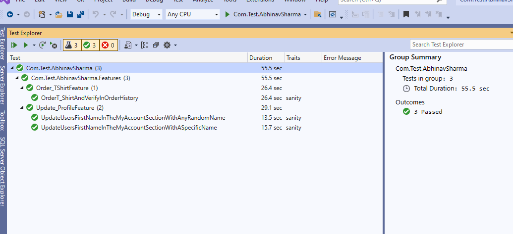

> Steps to run the test manually from any computer with .net core installation

1. Clone repo from https://dev.azure.com/777abhi/TestProject/_git/Com.Test.AbhinavSharma
2. Open CMD at the project location where .csproject file is located
2. Run command below command

```<cmd>
dotnet test
```

> Test Result CMD - 


> Test Result in VS 2019 - 


> Steps to run the tests in Azure pipeline
1. Navigate to 

